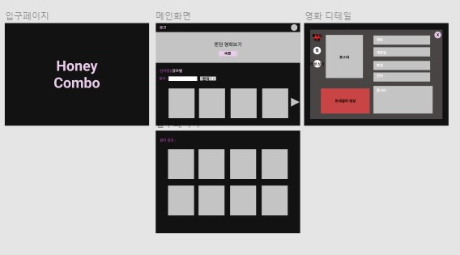
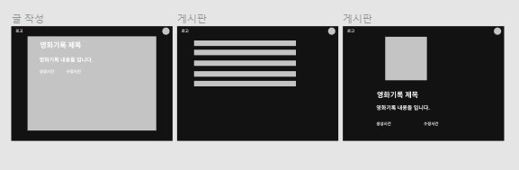
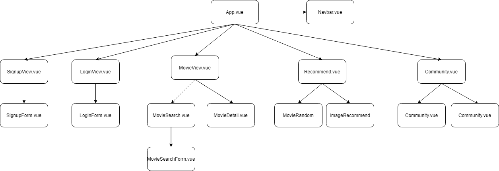
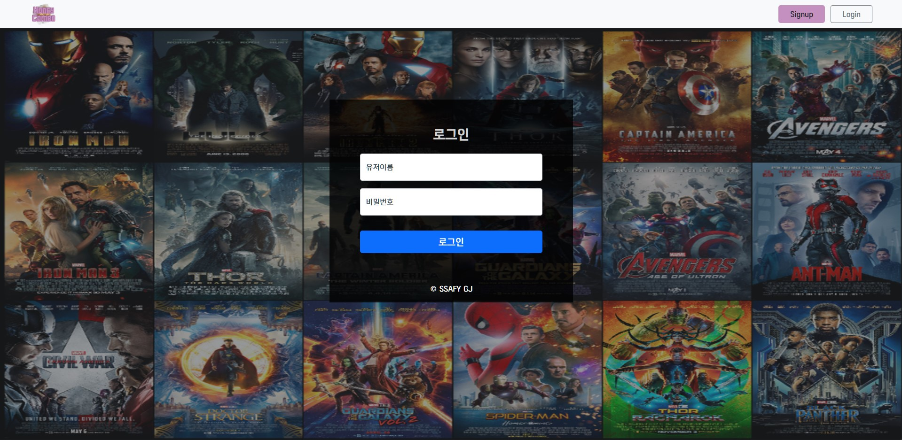
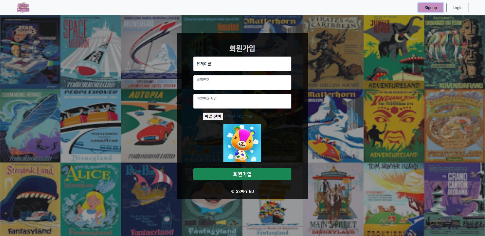
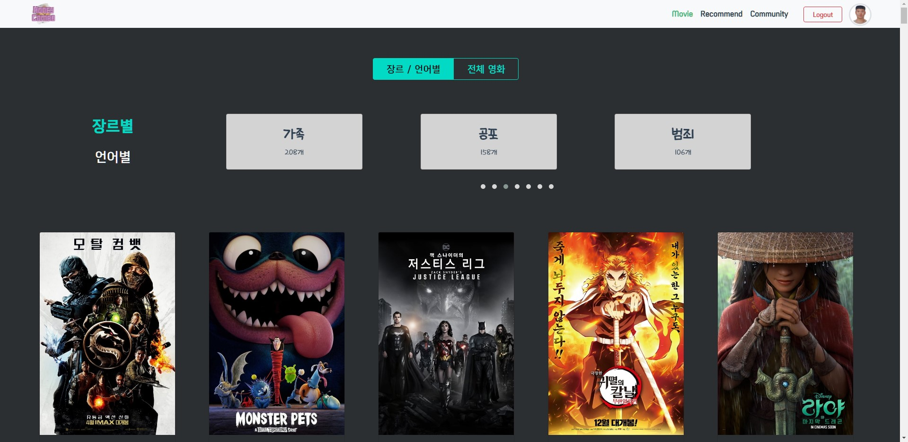
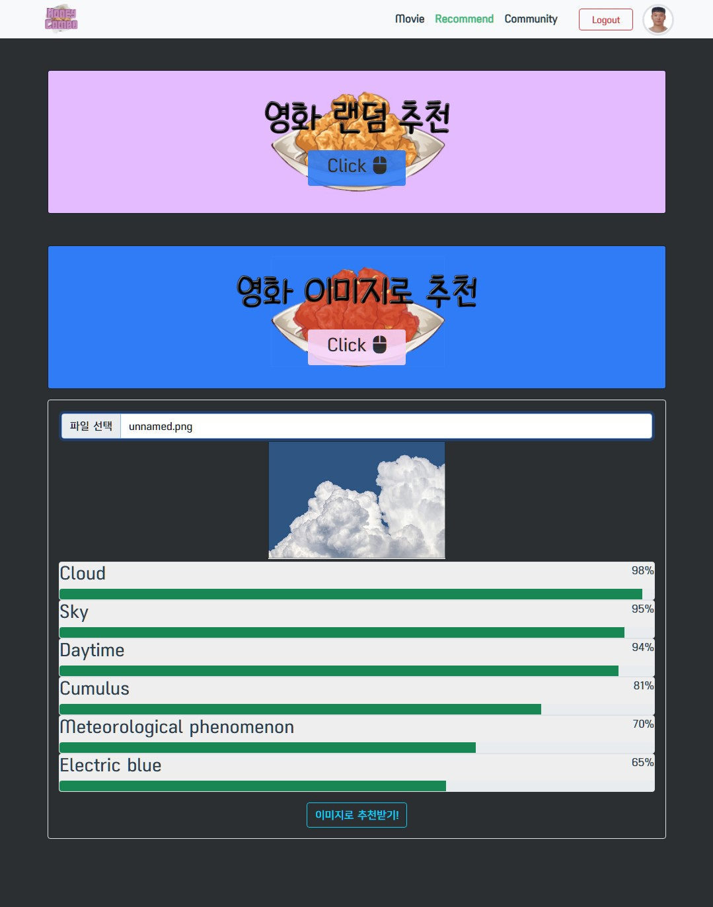

# FINAL PROJECT


[TOC]


## 1. 팀원 정보 및 업무 분담 내역

- 팀장 - 양준영
  - Full stack
  - 영화 정보 불러오기
  - 이미지 영화 추천 기능
  - 커뮤니티 댓글 기능
- 팀원 - 김은지
  - Full stack
  - 회원 관련 기능
    - 회원가입
    - 로그인
    - 프로필
  - 랜덤 영화 추천
  - 커뮤니티 기능


## 2. 데이터베이스 모델링 (ERD)


## 3. 목표 서비스 구현 및 실제 구현 정도

### 1. 목표 서비스(Figma)

####  회원 관련 기능


#### 영화 관련 기능




#### 커뮤니티 기능




### 2. 실제 구현 정도

#### vue 컴포넌트 구조



- 21개의 컴포넌트와 10개의 페이지로 vue를 구성하였다.


#### 회원 기능






#### 영화 정보







## 4. 사용 스택

- Django (Backend) - python  web framework
- Vue (Frontend) - javascript framework
- TMDB API - movie info api
- Vision API - Google image analyze api


## 5. 필수 기능에 대한 설명

- 회원기능

  - 로그인 : `simple jwt`를 이용하여 로컬 저장소에 `token`을 저장하여 로그인 정보를 불러온다.

  

- 영화 정보

  - tmdb : tmdb api를 활용하여 영화 정보를 `json`형태로 받고 로컬 DB에 저장을 하였다.

  ```python
  import json
  import requests
  
  API_KEY = 'db9ee7307099b152f07a73a5406c63ad'
  
  URL = f'https://api.themoviedb.org/3/movie/popular?api_key={API_KEY}&language=ko-KR&page='
  
  movie_list = []
  
  for i in range(1, 51):
      RE_URL = URL + str(i)
      response = requests.get(RE_URL)
      
      for movie in response.json().get('results'):
          movie_id = movie.get('id')
          VIDEO_URL = f'https://api.themoviedb.org/3/movie/{movie_id}/videos?api_key={API_KEY}&language=en-US'
          video_res = requests.get(VIDEO_URL)
          if video_res.json().get('results'):
              youtube_trailer = video_res.json().get('results')[0].get('key')
              movie['youtube_key'] = youtube_trailer
          movie_list.append(movie)
  
  file_path = './movie_list.json'
  
  with open(file_path, 'w', encoding="UTF-8") as outfile:
      json.dump(movie_list, outfile, indent=4, ensure_ascii=False)
  
  print(len(movie_list))
  ```

  

  - vue modal : 각 영화의 정보를 보여주기 위하여 page가 아닌 modal component로 만들어서 영화 정보를 modal로 띄워서 보여주었다.


- 추천기능

  - 랜덤으로 추천 : 랜덤으로 영화를 추천받는 기능을 사용하기 위해 axios 요청을 보내게 된다면, Django orm에서 한개를 랜덤으로 뽑아서 가져오게 하였다.

    ```python
    @api_view(['GET'])
    def movie_random(request):
        movie = Movie.objects.order_by('?')[0]
        serializer = MovieSerializer(movie)
        return Response(data=serializer.data)
    ```

    

  - 이미지 기반의 추천 : 사용자에게 이미지를 받으면 Google의 vision api를 통해 해당 이미지의 정보를 가져오게 하고, 해당 이미지 정보와 유사한 영화 목록들을 보여주는 기능을 구현하였다.

    

    

- 커뮤니티
  - CREATE : 영화 검색기능을 넣어서 해당 영화에 대한 리뷰 정보를 입력할 수 있게 만들었다.

